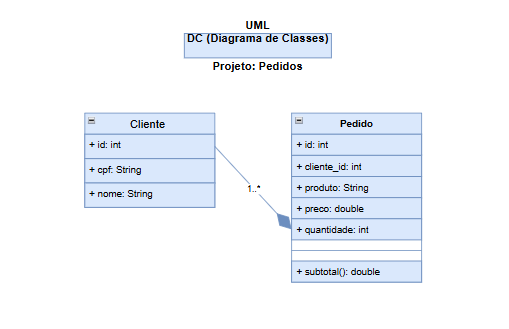

# Pedidos Backend MVC Dc 
Back-end com duas coleções mockup Json clientes e pedidos, CRUD, para aprender, MVC e UML diagrama de classes

## Diagrama 

## Tecnologias 
-Node.js
- VsCode (Thunder client)
- JavaScript
- MVC

## Passos para testar
- Clone este repositorio e abra com VsCode
- Instale as dependencias e execute com os seguintes comandos no terminal:
'''bash
npm install
npm run dev
''' 
